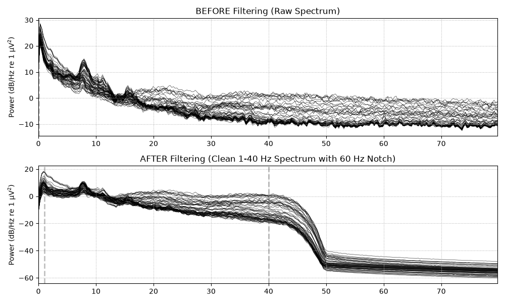
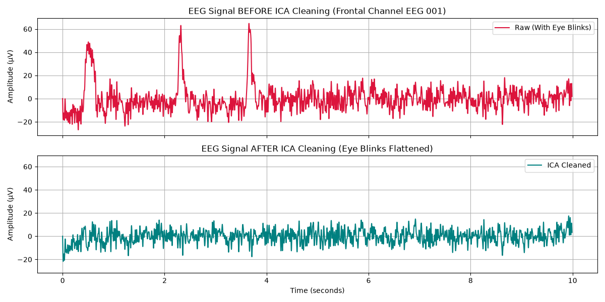

# Automated EEG Artifact Cleaning Pipeline via FastICA

An end-to-end Python pipeline built with **MNE-Python** to automatically identify and remove ocular artifacts (eye blinks) and powerline noise from raw multi-channel EEG signals without corrupting underlying neural activity.

---

##  Overview

Raw Electroencephalography (EEG) data is heavily contaminated by non-biological noise (line noise, baseline wander) and high-amplitude physiological artifacts (eye blinks, jaw clenches). This project implements an automated, reproducible data-cleaning workflow leveraging **Independent Component Analysis (ICA)** for blind source separation.

### Key Features
* **Bandpass Filtering (1.0 – 40 Hz):** Eliminates low-frequency baseline drift (< 1.0 Hz) and high-frequency electromyographic (EMG) muscle noise using FIR filters.
* **Notch Filtering (60 Hz):** Removes electrical grid hum.
* **FastICA Decomposition:** Solves blind source separation to isolate continuous EEG signals into independent biological components.
* **Automated Ocular Removal:** Uses EOG channel correlation (`ica.find_bads_eog`) to flag and isolate eye-blink components automatically.
* **Quantitative Validation:** Computes signal variance reduction to objectively measure artifact removal quality.

---

## Quantitative Metrics

Evaluated on frontal channel `EEG 001` (most susceptible to ocular contamination):

| Metric | Value | Interpretation |
| :--- | :--- | :--- |
| **Components Removed** | `IC00` | Successfully isolated eye blink spatial topography |
| **Original Signal Variance** | $1.46 \times 10^{-10} \text{ V}^2$ | Driven by high-amplitude eye-blink spikes |
| **Cleaned Signal Variance** | $4.57 \times 10^{-11} \text{ V}^2$ | Preserves physiological background brain activity |
| **Artifact Variance Reduction** | **68.69%** | ~70% of non-biological noise power successfully scrubbed |

---

## Visual Results

### 1. Frequency Domain: Filtering & Power Spectral Density (PSD)
*Low-frequency baseline wander (< 1 Hz) and high-frequency noise are eliminated while preserving the natural ~10 Hz alpha band peak.*



### 2. Time Domain: Automated Eye-Blink Artifact Removal
*Demonstration on frontal channel `EEG 001`. High-amplitude ocular spikes are flattened completely while underlying cortical oscillations remain intact.*



---

## 🧠 Mathematical Background

The pipeline resolves the blind source separation problem represented by:

$$\mathbf{X} = \mathbf{A}\mathbf{S}$$

Where:
* $\mathbf{X} \in \mathbb{R}^{N \times T}$ is the matrix of observed multi-channel EEG signals ($N$ channels, $T$ timepoints).
* $\mathbf{A} \in \mathbb{R}^{N \times M}$ is the unknown mixing matrix representing spatial conduction through skull and tissue.
* $\mathbf{S} \in \mathbb{R}^{M \times T}$ is the matrix of independent source signals (cortical activity + physiological noise).

**FastICA** computes an unmixing matrix $\mathbf{W} \approx \mathbf{A}^{-1}$ that maximizes non-Gaussianity via fixed-point iteration, isolating clean source components $\mathbf{S} = \mathbf{W}\mathbf{X}$.

---

## Project Structure

```text
eeg-ica-pipeline/
├── images/
│   ├── filter_spectrum.png   # PSD spectrum plot
│   └── eeg_ica_cleaning.png  # Time-series comparison plot
├── 01_filter_data.py         # Filtering & PSD spectral analysis
├── 02_ica_clean.py           # FastICA decomposition & blink removal
├── 03_metrics.py             # Quantitative validation script
├── README.md                 # Project documentation
└── .gitignore                # File exclusions
```
## How to Run

1. Clone the Repository, 
git clone [https://github.com/YOUR-USERNAME/eeg-ica-pipeline.git](https://github.com/YOUR-USERNAME/eeg-ica-pipeline.git)
cd eeg-ica-pipeline
2. Install dependencies 
pip install mne scikit-learn matplotlib numpy
3. Execute pipeline scripts sequentially: 
python 01_filter_data.py then
python then 02_ica_clean.py 
python then 03_metrics.py

___
## Data Acknowledgments & Citation

This project utilizes the MNE Sample Dataset [1], an open-source multimodal neuroimaging dataset collected at the Martinos Center for Biomedical Imaging at Massachusetts General Hospital.
Source: MGH/HMS/MIT Martinos Center for Biomedical Imaging
Modalities: 60 EEG channels, dedicated EOG ocular channels
Sampling Frequency: 600 Hz

Citation:

[1] Gramfort, A., Luessi, M., Larson, E., Engemann, D. A., Strohmeier, D., Brodbeck, C., Parkkonen, L., & Hämäläinen, M. S. (2014). MNE software for processing MEG and EEG data. NeuroImage, 86, 446–467. https://doi.org/10.1016/j.neuroimage.2013.10.027
